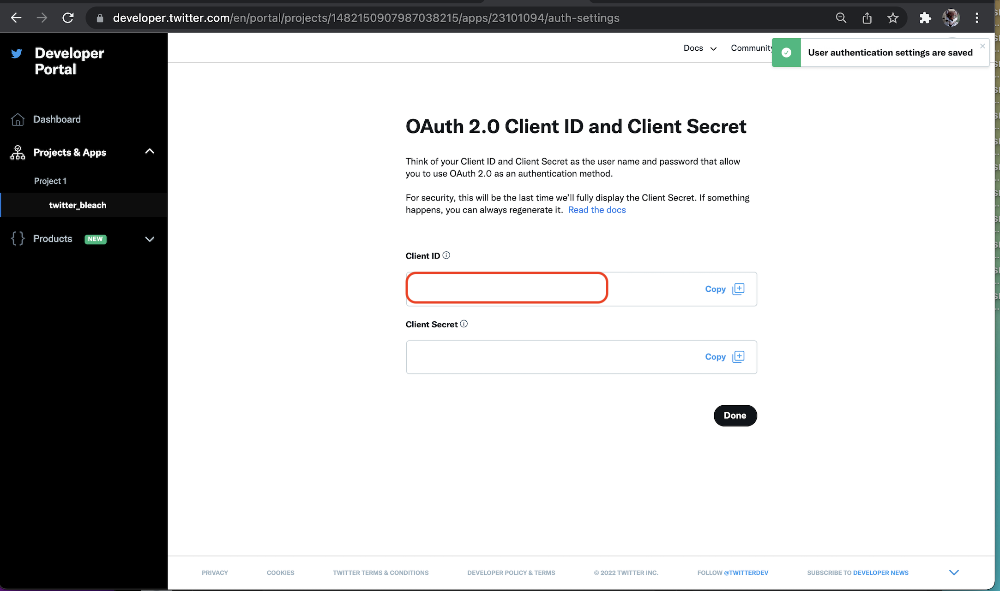

# twitter_bleach

Unlike all Tweets, delete Tweets (not implemented yet[^1]) and unfollow all other Twitter users (not implemented yet[^1]). Uses the Twitter
API to automate the process of bleaching all Twitter activity without needing to delete your account.

Some Twitter activity, such as "Bookmarked Tweets" aren't yet accessible through the official API so twitter_bleach can't do anything with those aspects of an account. 

The Twitter version 2 API rate-limits the number of requests that can be made. This means it can take time to
fully drain all of the activity from an account. As an example the rate limit of 50 API calls every 15/min means a maximum of 4800 Tweets can
'unliked' in a day.

Taking the rate limits in to consideration the code is written to try to 'pick up where it left off'. It
doesn't have to be run continually, all in one go, to be effective. It can run for a while, be stopped, an run again to keep
going without progress being lost. 

### Twitter application Set-up 
> If you don't have a Twitter developer account and don't know how to set up a Twitter API Application, there is a step-by-step guide [here](docs/twitter_application_setup.md).

Create a Twitter application on your developer account. The account settings are

- Authentication is `OAuth 2.0`. 
- Type of App is `Native App`
- Call back URIs are[^3]
  - http​://127.0.0.1:8888/
  - http​://127.0.0.1:8880/
  - http​://127.0.0.1:8080/
  - http​://127.0.0.1:9977/
  - http​://127.0.0.1:4356/
  - http​://127.0.0.1:3307/
- Website URL can be anyhting, but `https://github.com/rdpickard/twitter_bleach` would be nice.

__Note:__ Callback URIs are `http` _not_ `https`. 

The Client ID value is needed by the script. The script does not need any API tokens or other secrets. It
will generate a bearer token using OAuth flow whn it runs.

Copy the Client ID

Setting up a Twitter Application only needs to be done once.

### Implementation details

Written in Python3. Uses the [pytwitter](https://github.com/sns-sdks/python-twitter) Python module for accessing [Twitter API version 2](https://developer.twitter.com/en/docs/twitter-api).

[^1]: Still developing the project. Doing one type of 'bleaching' at a time. -1/14/22

[^3]: The twitter_bleach script runs a small http listener to capture the callback of the OAuth 2 log in flow. The 
scripts stops listening after the OAuth flow is finished. The script will try to bind to a series of ephemeral ports. 
Just in case there happens to be some other process listening on one of the ports.

