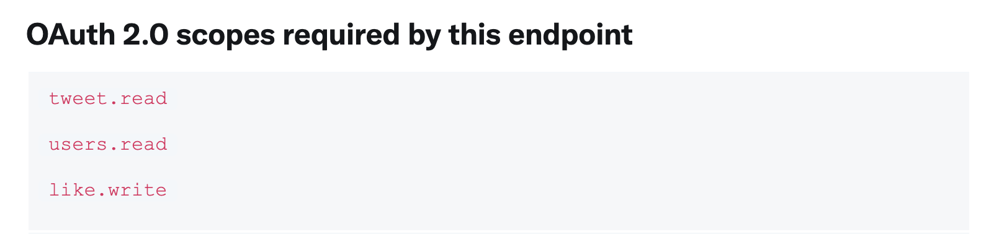
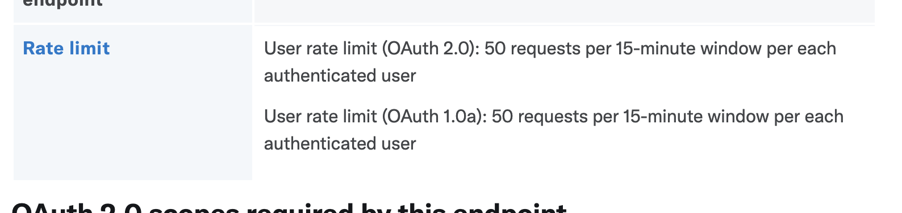
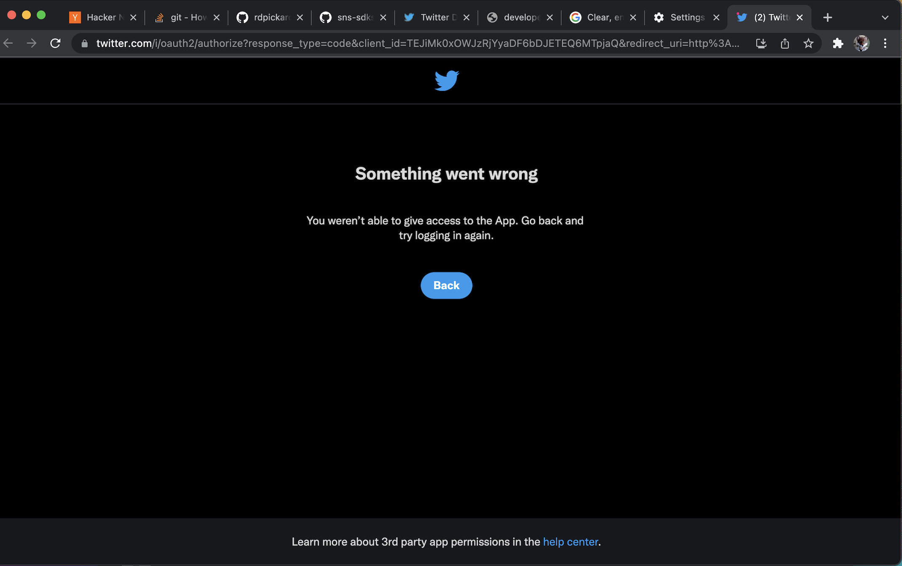
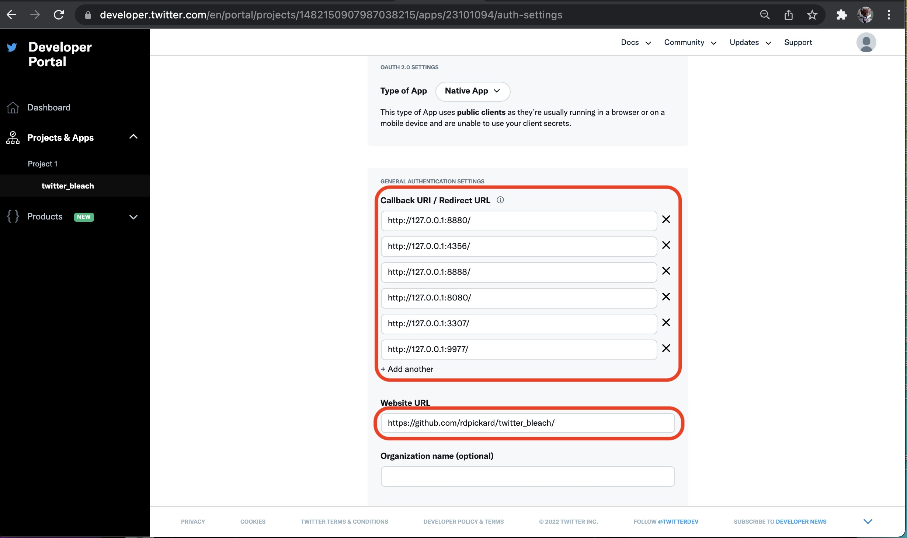
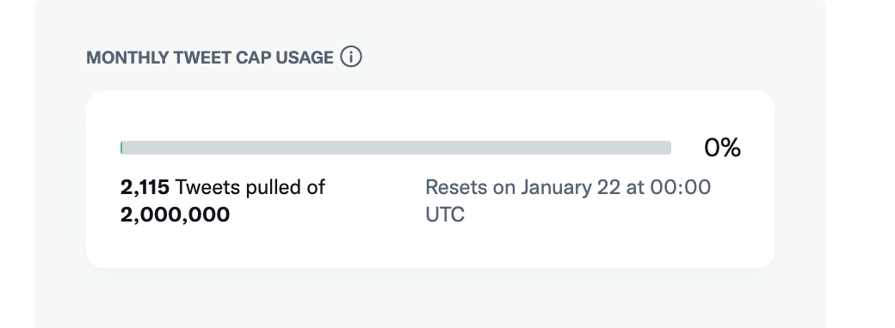

# Notes on working with Twitter API and pytwitter module

## Links 
[Twitter Bleach app settings](https://developer.twitter.com/en/portal/projects/1481287758740172805/apps/23077725/settings)

[Twitter APIv2 ref](https://developer.twitter.com/en/docs/api-reference-index)

[pytwitter git homepage](https://github.com/sns-sdks/python-twitter/tree/master/pytwitter)

## Trouble shooting
### API request returns 403
The request might require a scope that was not included in the original authorization. Check the
'OAuth 2.0 scopes required by this endpoint' section of API reference documentation on Twitter site. Make sure the
`scope` parameter of the call to `pytwitter.Api` includes the required scope in the list.



```
# Example of making sure the API authentication includes needed scope

# Scopes strings from Twitter documentaiton
twitter_api_scopes = ['tweet.read', 'users.read', 'like.write']

# Pass scopes to API creation
TWITTER_CLIENT_ID = "ZZZZZZZ"
api = pytwitter.Api(client_id=TWITTER_CLIENT_ID, 
                    oauth_flow=True, 
                    scopes=twitter_api_scopes)

# Stuff to complete OAuth 2 skipped for bevity 
          
# Now this call won't return a 403   
my_twitter_id = "XXXXXX"  
tweet_id_to_delete = "YYYYYY"
api.unlike_tweet(my_twitter_id, tweet_id=tweet_id_to_delete)
```
### API request returns 403 after running for a while

Maybe bearer token expired?

### API request returns 'Too Many Requests' with HTTP status code 429

Some calls have rate limiting on them. 



End point rate limit windows are per end point, not cumulative for all end points. For example the rate limit of requests
to end point `DELETE /2/users/:id/likes/:tweet_id` are counted in their own 15 min window from `GET /2/users/:id/followers` window. This
should be taken into consideration when working through a process that makes calls to end points
that return multiple results and end points are applied to a single result. 

If an API call is made that exceeds the rate limit the pytwitter method will
through a pytwitter.error.PyTwitterError exception. This exeption can be caught and introduce a pause

```
# Example of adding a pause in a loop to work with rate limits

pagination_token = None
my_id = "XXXXXX"

while True:
    try:
        liked_tweets = api.get_user_liked_tweets(user_id=my_id, max_results=5, pagination_token=pagination_token, return_json=True)
        
        if "next_token" not in liked_tweets["meta"].keys():
            # If there is no next_token in results for pagination there are no more results 
            break
    except pytwitter.error.PyTwitterError as ptw:
        # I'm not sure if all PyTwitterError instances will have a dictionary as a message so I'm being cautious 
        if type(ptw.message) is dict and ptw.message.get('status', -1) == 429:
            print("Rate Limit exceeded. WAITING 15 min")
            time.sleep(900)
            continue
        elif type(ptw.message) is dict and 'status' in ptw.message.keys():
            print("PyTwitterError with unknown status '{}' message '{}'".format(ptw.message['status'], message))
        else:
            print("PyTwitterError unknown message type '{}'".format(message))
        break
    except Exception as e:
        # Handle other eventualities
        print(e)
        break

```
### "Something went wrong" message in Authorize App OAuth2 flow



This happens when the redirect URL passed in to the `get_oauth2_authorize_url` pytwitter function is not included in the Twitter application Callback URL list

If the code is 
```
twitter_auth_callback_redirect_url="http://localhost:8888"
twitter_user_auth_url, code_verifier, _ = api.get_oauth2_authorize_url(redirect_uri=twitter_auth_callback_redirect_url)
```

And the Twitter Application Callback URLs list is configured as



The user will get "Something went wrong" message. 

The reason is the redirect URL in the code `http://localhost:8888` is not in the list of Callback URLs. The Callback URL list host is all `127.0.0.1`. The URLs have to be exactly the same.

## Rate limits

With rate-limits it would take about 6 and a half days to 'Unlike' 30k tweets
 - 200 unlike requests /hour (1000 every 5 hours)
 - 4800 unlike requests /day
 - 30000 liked tweets/4800 unlike requests a day - 6.25 days

There is a ["Tweet cap volume" rate](https://developer.twitter.com/en/docs/twitter-api/tweet-caps) that limits the number of total Tweets an app can access through the API every month. I
am not sure how this rate manifests in the API. The "Cap Usage" for the app can be seen in the [developer portal page](https://developer.twitter.com/en/portal/dashboard). Its not
clear if the cap is accessible through the API



### API request returns 503

Not sure why this happens. Only seen it once.

## Miscellaneous

~~API bearer tokens don't seem to expire.~~ This seems wrong. After an hour of running code gets 403