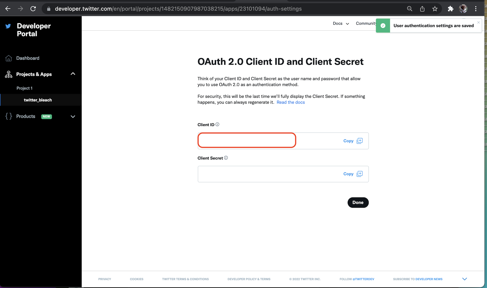

Twitter mediates access to it's API through a notion of discrete Applications. A Twitter user can't make calls to the API with by logging into it with their username and password. The way the API access is set up an Application has to be acting on behalf of a user. These set up
steps will register[^2] an Application with Twitter so that the twitter_bleach script can make the calls to delete activity on the user's behalf. 

>It is possible to implement twitter_bleach in a way that wouldn't require these set-up steps, but this way I think it the most secure. It
doesn't require a third party to have access to your account and there isn't a need to give the script your Twitter username and password. 

_For the functionality twitter_bleach needs to run there is no cost to the user for registering an Application with Twitter._

These steps assume you already have a Twitter account. To qualify for a Twitter developer account your Twitter user account must have a phone number associated with it. Email verification isn't sufficient. These steps will let you know if your Twitter user account needs to have a phone number attached.

#### Set-up step 1: Register for developer privileges on your Twitter account. 

*Go to https://developer.twitter.com. Follow the steps to set up the development account*

*You can name the Application what ever but a descriptive name is a good choice*

*You won't need the API key or API key secret values in this case of twitter_bleach*

*This is the dashboard of all Twitter Applications. Click the link on the left for the Application to use with twitter_bleach*

#### Set-up step 2: Configure the Application for API access

*Click Set Up under User Authentication Settings*

*Toggle OAuth 2.0 on. Leave OAuth 1.0a off*

*Select Native App for Type of App*

*Add the following URLs to the list of Callback URLs*

  - http​://127.0.0.1:8888/
  - http​://127.0.0.1:8880/
  - http​://127.0.0.1:8080/
  - http​://127.0.0.1:9977/
  - http​://127.0.0.1:4356/
  - http​://127.0.0.1:3307/

__Note:__ Callback URIs are `http` _not_ `https`. 

- Website URL can be anything, but `https://github.com/rdpickard/twitter_bleach` would be nice.

#### Set-up step 3: Copy the Application's Client ID

That's all the set-up that needs to be done. 

The other values that are part of the set-up process like API Key and API Key Secret are not needed by twitter_bleach.
